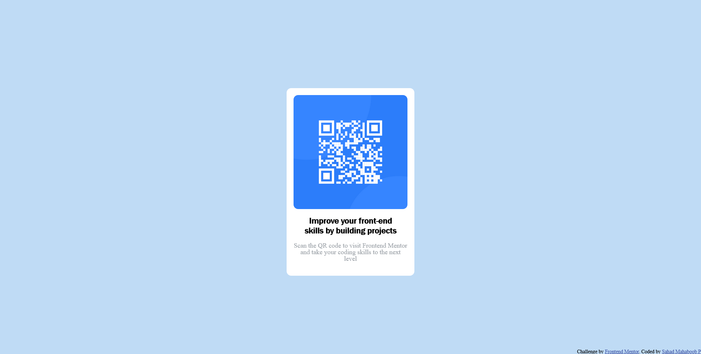

# Frontend Mentor - QR code component solution

<h3 align="center"><b>QR Code</b></h3>

  <a href="https://sahadcmd.github.io/QR-Code/">View Demo</a>

  
 
 

This is a solution to the [QR code component challenge on Frontend Mentor](https://www.frontendmentor.io/challenges/qr-code-component-iux_sIO_H).

## Preview

  

 

## Built with

-    
-   
- Flexbox
- CSS Grid

## Tools Used

-  

## Outcome

* Used HTML5 **semantic elements** for better readability and structure
* Used CSS3 **grid** and **flex** to manage layouts
* Tried to maintain **clean code**
* **Cross tested** on Firefox and Chromium based browsers

## What I learned

* Leveraging the interplay of CSS Grid and Flexbox to create flexible and adaptable layouts
* A lot of minor things

## Author

